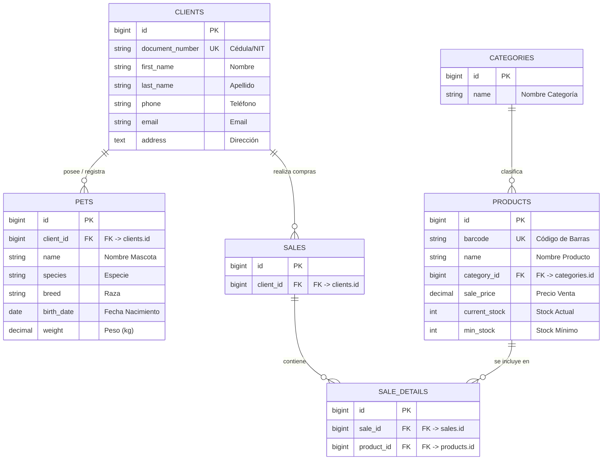

# 🐾 Análisis de Negocio y Diseño ERP: Veterinaria Huellitas

| Información del Proyecto | Detalles |
| :--- | :--- |
| **Asignatura** | Software de Gestión Empresarial |
| **Institución** | COTECNOVA - 2026 |
| **Integrantes** | 👨‍💻 **Esteban Molina** & **Heiber Lozano** |
| **Repositorio GitHub** | [https://github.com/moliech/parcial1-erp](https://github.com/moliech/parcial1-erp) |
| **Rama Oficial** | `parcial` |

---

## 1. Análisis del Negocio

### 1.1 Datos Generales
* **Nombre de la Empresa:** Veterinaria Huellitas
* **Giro Comercial:** Servicios de atención médica veterinaria y comercialización de productos para mascotas, como medicamentos, alimentos, accesorios y juguetes.
* **Tamaño:** Pequeña Empresa (Pyme).

### 1.2 Procesos Clave del Negocio
* **Ventas (Tienda / POS):** El cliente solicita los productos, se registran mediante código de barras, se calcula el valor de la compra, se realiza el cobro y se actualiza el inventario.
* **Servicios (Atención Clínica):** El propietario solicita una cita para consulta, vacunación, cirugía, baño o peluquería. Se agenda el servicio, se vincula la mascota con su propietario y se registra la atención realizada.
* **Compras:** La veterinaria solicita y recibe productos de sus proveedores. Al recibir la mercancía se registra la factura, los productos adquiridos, cantidades, costos y, cuando corresponda, los lotes y fechas de vencimiento.
* **Inventario:** Los productos se organizan por categorías y se controla la cantidad disponible. El sistema permite identificar existencias bajas y realizar seguimiento de los lotes y fechas de vencimiento de los medicamentos.
* **Clientes:** Se registran los datos de los propietarios y se vinculan sus mascotas, permitiendo consultar la información asociada a cada animal.

### 1.3 Problemas Detectados
1. **Desorganización e información duplicada:** El manejo de la información en cuadernos y hojas de cálculo puede generar registros duplicados, pérdida de información y errores en el control de ventas e inventario.
2. **Pérdida de dinero por insumos vencidos:** La ausencia de un control detallado de lotes y fechas de vencimiento dificulta identificar oportunamente los medicamentos próximos a caducar y puede generar pérdidas económicas.
3. **Falta de agendamiento unificado:** La ausencia de un sistema centralizado para gestionar las citas puede generar demoras en la atención y dificultar el seguimiento de los servicios realizados a cada mascota.

### 1.4 Justificación del ERP
> [!IMPORTANT]
> **¿Por qué la Veterinaria Huellitas necesita un ERP?**  
> La Veterinaria Huellitas necesita un ERP centralizado que permita integrar en una sola plataforma la gestión de clientes, mascotas, servicios, ventas, compras e inventario. Esto facilitaría la organización de la información, reduciría errores y duplicidad de registros, permitiría controlar las existencias y fechas de vencimiento de los productos y mejoraría el acceso a información para la toma de decisiones del dueño de la veterinaria.

---

## 2. Diseño del Modelo de Datos

### 2.1 Diagrama Entidad-Relación (MER)

### 2.2 Diccionario de Datos

#### Tabla: `clients` (Dueños de Mascotas)
| Tabla | Campo | Tipo | Descripción / Restricción |
| :--- | :--- | :--- | :--- |
| `clients` | `id` | `BIGINT` | Clave primaria autoincrementable |
| `clients` | `document_number` | `VARCHAR(20)` | Cédula o NIT del propietario. Valor único |
| `clients` | `first_name` | `VARCHAR(100)` | Primer nombre del propietario |
| `clients` | `last_name` | `VARCHAR(100)` | Apellidos del propietario |
| `clients` | `phone` | `VARCHAR(20)` | Teléfono de contacto |
| `clients` | `email` | `VARCHAR(150)` | Correo electrónico de contacto |
| `clients` | `address` | `TEXT` | Dirección de residencia |

#### Tabla: `pets` (Mascotas / Pacientes)
| Tabla | Campo | Tipo | Descripción / Restricción |
| :--- | :--- | :--- | :--- |
| `pets` | `id` | `BIGINT` | Clave primaria autoincrementable |
| `pets` | `client_id` | `BIGINT` | Clave foránea que referencia a `clients.id` |
| `pets` | `name` | `VARCHAR(100)` | Nombre de la mascota |
| `pets` | `species` | `VARCHAR(50)` | Especie de la mascota |
| `pets` | `breed` | `VARCHAR(50)` | Raza de la mascota |
| `pets` | `birth_date` | `DATE` | Fecha de nacimiento |
| `pets` | `weight` | `DECIMAL(5,2)` | Peso de la mascota en kilogramos |

#### Tabla: `products` (Productos e Insumos)
| Tabla | Campo | Tipo | Descripción / Restricción |
| :--- | :--- | :--- | :--- |
| `products` | `id` | `BIGINT` | Clave primaria autoincrementable |
| `products` | `barcode` | `VARCHAR(50)` | Código de barras único para identificación en POS |
| `products` | `name` | `VARCHAR(150)` | Nombre comercial del producto |
| `products` | `category_id` | `BIGINT` | Clave foránea que referencia a `categories.id` |
| `products` | `sale_price` | `DECIMAL(10,2)` | Precio de venta al público |
| `products` | `current_stock` | `INT` | Cantidad disponible del producto |
| `products` | `min_stock` | `INT` | Cantidad mínima para generar alerta de reabastecimiento |

---

## 3. Propuesta de Solución ERP

### 3.1 Módulos del Sistema ERP (5 Módulos)
1. **Módulo de Clientes y Mascotas:** Permite registrar los datos de los propietarios y asociar sus mascotas como pacientes.
2. **Módulo de Citas y Clínica:** Permite gestionar el agendamiento de consultas, vacunaciones, cirugías, baño y peluquería, así como registrar la atención realizada.
3. **Módulo POS y Facturación:** Permite registrar las ventas de productos y servicios, realizar el cobro y generar la información correspondiente a la venta.
4. **Módulo de Inventarios y Lotes:** Permite controlar las existencias de productos, consultar el stock disponible y generar alertas cuando las cantidades estén por debajo del mínimo establecido.
5. **Módulo de Compras:** Permite gestionar el abastecimiento de productos y mantener un registro de las compras realizadas a los proveedores.

### 3.2 Flujo Integrado del Sistema
> [!NOTE]
> **Flujo Integrado de Atención y Venta:**  
> *Cuando un cliente llega con su mascota a la veterinaria, la atención se registra en el módulo de **Citas y Clínica** y se consulta la información del propietario y su mascota. Una vez realizada la atención, los servicios y productos utilizados o vendidos se registran en el sistema. El módulo de **Inventario** actualiza las existencias de los productos y el módulo **POS** registra el cobro correspondiente. Finalmente, la venta queda asociada al cliente para facilitar su consulta y seguimiento.*

### 3.3 Indicadores Clave (KPIs)
* 📊 **Facturación Total Mensual:** Valor total de las ventas realizadas durante el mes, diferenciando entre productos y servicios.
* 🔄 **Tasa de Retención de Pacientes:** Porcentaje de mascotas que regresan a la veterinaria para nuevas atenciones durante un periodo determinado.
* 📦 **Rotación de Inventario:** Frecuencia con la que los productos salen del inventario durante un periodo determinado.

### 3.4 Beneficios Clave
* ✅ **Reducción de errores:** La centralización de la información disminuye la duplicidad de registros y facilita el control de ventas e inventario.
* ✅ **Mejor control del inventario:** Permite consultar existencias y detectar oportunamente productos que requieren reabastecimiento.
* ✅ **Información para la toma de decisiones:** Los registros centralizados permiten generar reportes e indicadores sobre ventas, servicios e inventario.
